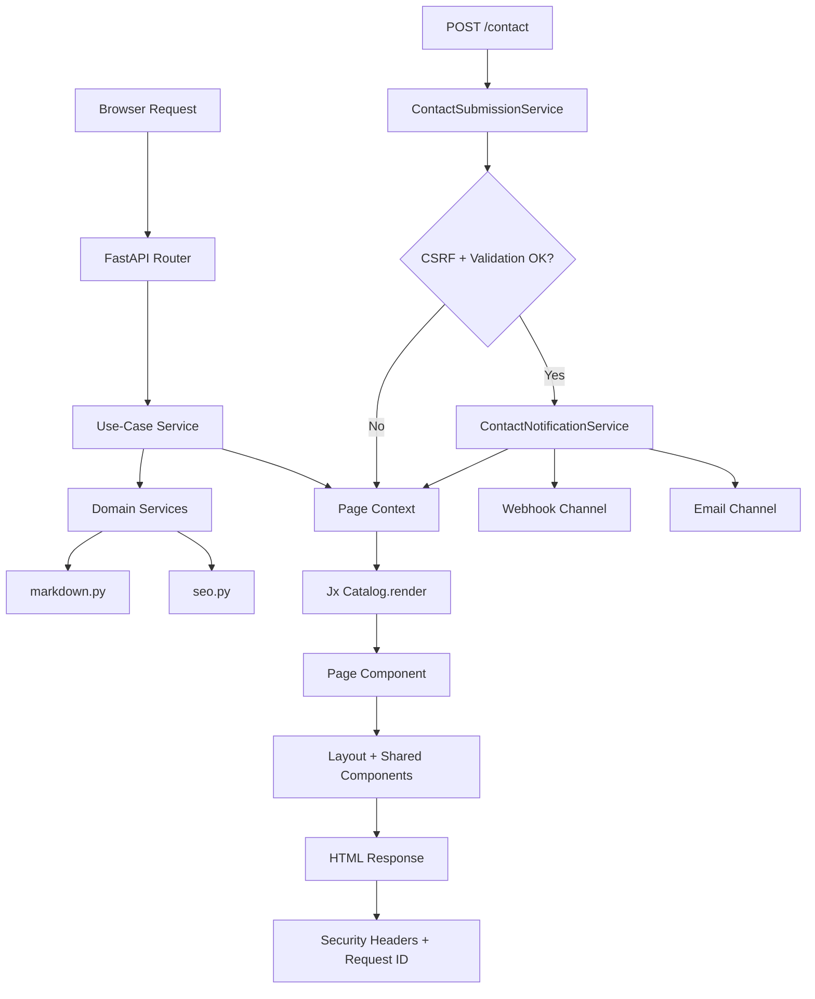

# Portfolio (Backend + Frontend)

## Overview

This project is a server-rendered portfolio built with FastAPI and Jx.
The backend handles routing, validation, security, and business flows.
The frontend is component-based (`.jinja`) and rendered on the server through
`Catalog.render(...)`.

## Stack

### Backend

| Technology              | Responsibility                                      |
| ----------------------- | --------------------------------------------------- |
| FastAPI                 | HTTP routing, dependency injection, middleware      |
| Uvicorn                 | ASGI runtime                                        |
| Pydantic v2             | Input and schema validation                         |
| pydantic-settings       | Environment-based app configuration                 |
| SlowAPI                 | Rate limiting on contact submissions                |
| httpx                   | Outbound webhook notifications                      |
| smtplib + email.message | SMTP email notification channel                     |
| markdown + pygments     | Markdown parsing with code highlighting             |
| PyYAML                  | YAML frontmatter parsing                            |

### Frontend and Rendering

| Technology | Responsibility                                      |
| ---------- | --------------------------------------------------- |
| Jx         | Component system on top of Jinja2                   |
| Jinja2     | Template runtime used by Jx                         |
| CSS        | Styling in `static/css/global.css`                  |
| JS         | Small client bootstrapping in `static/js/main.js`   |
| Markdown   | Content source for About and Project detail pages   |

### Quality and Tooling

| Tool    | Responsibility                |
| ------- | ----------------------------- |
| Ruff    | Python linting                |
| ty      | Static type checking          |
| rumdl   | Markdown linting/formatting   |

## Project Structure

```text
app/
  main.py
  config.py
  dependencies.py
  logger.py
  security.py
  routers/
  services/
  schemas.py
  models.py
components/
  layouts/
  seo/
  nav/
  footer/
  hero/
  cards/
  tags/
  markdown/
  contact/
  pages/
content/
  about.md
  projects/*.md
static/
  css/global.css
  js/main.js
  images/
```

## Backend Architecture

### Entry and Runtime

- `app/main.py`: app factory, middleware, exception handlers, and router setup.
- `app/config.py`: typed settings loaded from environment.
- `app/logger.py`: structured logs and request context.
- `app/security.py`: CSRF helpers and security/tracing middleware.

### Thin HTTP Routers

- `app/routers/home.py`
- `app/routers/about.py`
- `app/routers/projects.py`
- `app/routers/contact.py`

Routers delegate logic to injected services (`Depends(...)`).

### Use-Case Layer

- `app/services/use_cases.py`
  - `HomePageService`
  - `AboutPageService`
  - `ProjectsPageService`
  - `ContactPageService`
  - `ContactSubmissionService`

### Domain and Infra Services

- `app/services/seo.py`: SEO metadata generation.
- `app/services/markdown.py`: markdown + frontmatter loading.
- `app/services/contact.py`: notification channels and dispatch.
- `app/dependencies.py`: DI providers, singleton catalog, and service graph.

## Frontend Architecture (Jx)

### Component Layers

- `components/layouts/base.jinja`: root layout, SEO head, navbar, footer.
- `components/seo/head.jinja`: meta tags, Open Graph, Twitter tags, JSON-LD.
- `components/nav/navbar.jinja`: main navigation with active route state.
- `components/footer/footer.jinja`: footer and social links.
- `components/hero/hero.jinja`: home intro section.
- `components/cards/project_card.jinja`: project list cards.
- `components/tags/tag_badge.jinja`: reusable tag badges.
- `components/markdown/prose.jinja`: markdown HTML wrapper (`| safe`).
- `components/contact/contact_form.jinja`: contact form with CSRF field.
- `components/pages/*.jinja`: route-level page composition.

### Static Assets

- `static/css/global.css`: global UI tokens and component styles.
- `static/js/main.js`: lightweight client initialization.
- `static/images/projects/*.svg`: project thumbnails.
- `static/images/og-default.png`: default Open Graph image.

### Content Source

- `content/about.md`
- `content/projects/*.md`

Each markdown file can include YAML frontmatter:
`title`, `slug`, `description`, `thumbnail`, `tags`, `tech_stack`, `date`,
`featured`, and external links.

## Route to Template Mapping

| Method | Path               | Template                                | Main Services                                            |
| ------ | ------------------ | --------------------------------------- | -------------------------------------------------------- |
| GET    | `/`                | `components/pages/home.jinja`           | `HomePageService`, `markdown`, `seo`                     |
| GET    | `/about`           | `components/pages/about.jinja`          | `AboutPageService`, `markdown`, `seo`                    |
| GET    | `/projects`        | `components/pages/projects.jinja`       | `ProjectsPageService`, `markdown`, `seo`                 |
| GET    | `/projects/{slug}` | `components/pages/project_detail.jinja` | `ProjectsPageService`, `seo`                             |
| GET    | `/contact`         | `components/pages/contact.jinja`        | `ContactPageService`, CSRF generation                    |
| POST   | `/contact`         | `components/pages/contact.jinja`        | `ContactSubmissionService`, `ContactNotificationService` |
| GET    | `*` (404)          | `components/pages/not_found.jinja`      | `seo`                                                    |

## End-to-End SSR Flow (Mermaid)



## Security Highlights

- CSRF token with HMAC signature and expiration.
- Pydantic validation with strict schema (`extra="forbid"`).
- Rate limiting on contact form POST.
- Security headers middleware (CSP, HSTS, X-Frame-Options, etc.).
- Request tracing with `X-Request-ID`.

## Local Commands

```bash
# Python lint
uv run ruff check app

# Static type check
uv run ty check app

# Markdown lint
uv run rumdl check .

# Optional: markdown format
uv run rumdl fmt README.md

# Run app
uv run uvicorn app.main:app --reload --host 0.0.0.0 --port 8000
```
