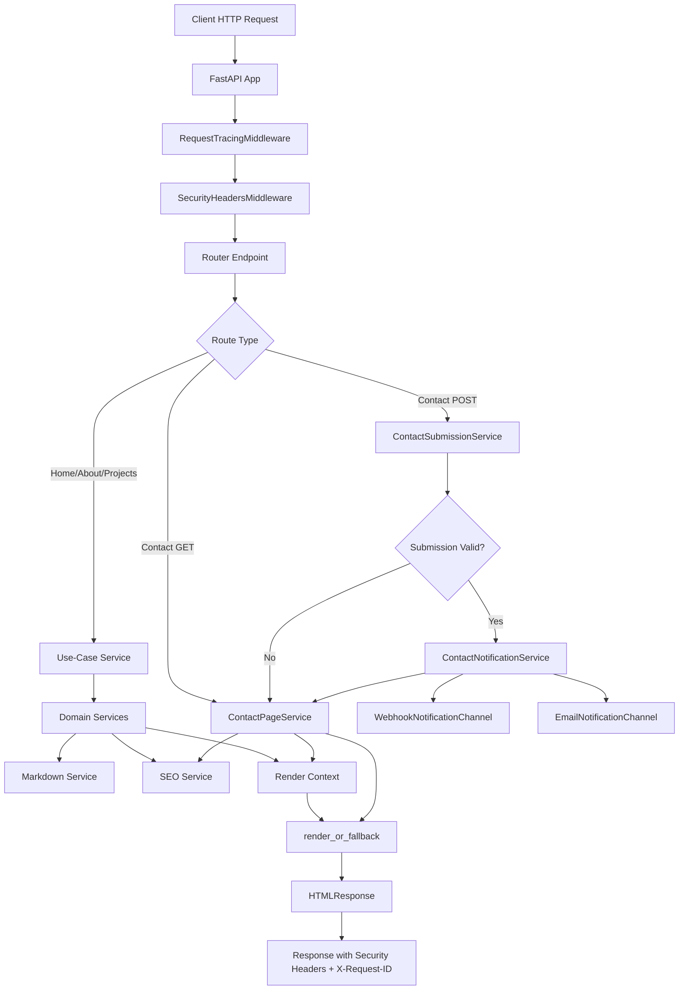

# Portfolio Backend

## Overview

This backend is a FastAPI application that renders HTML with Jx components,
validates data with Pydantic, and applies a use-case driven service layer with
dependency injection.

The application is organized to keep routers thin and move business rules to services.

## Technologies

| Technology              | Role in Backend                                     |
| ----------------------- | --------------------------------------------------- |
| FastAPI                 | HTTP API, routing, dependency injection, middleware |
| Uvicorn                 | ASGI server runtime                                 |
| Pydantic v2             | Schema validation (`ContactForm`, `SEOMeta`)        |
| pydantic-settings       | Environment-based configuration (`Settings`)        |
| Jx                      | Server-side component rendering (`catalog.render`)  |
| SlowAPI                 | Rate limiting for contact form submissions          |
| httpx                   | Webhook notification channel                        |
| smtplib + email.message | SMTP email notification channel                     |
| markdown + pygments     | Markdown parsing and syntax highlighting            |
| PyYAML                  | Frontmatter parsing for content files               |
| Ruff                    | Linting                                             |
| ty                      | Static type checking                                |
| rumdl                   | Markdown linting and formatting                     |

## Backend Architecture

### Entry and Runtime

- `app/main.py`: app factory, middleware wiring, exception handlers, router registration.
- `app/config.py`: typed settings and environment configuration.
- `app/logger.py`: centralized structured logging and request context propagation.
- `app/security.py`: CSRF helpers and security/tracing middleware.

### HTTP Layer (Thin Routers)

- `app/routers/home.py`
- `app/routers/about.py`
- `app/routers/projects.py`
- `app/routers/contact.py`

Routers now delegate use-case logic to injected services (`Depends(...)`).

### Use-Case Layer

- `app/services/use_cases.py`
  - `HomePageService`
  - `AboutPageService`
  - `ProjectsPageService`
  - `ContactPageService`
  - `ContactSubmissionService`

### Domain/Infrastructure Services

- `app/services/seo.py`: SEO metadata composition.
- `app/services/markdown.py`: markdown/frontmatter loading.
- `app/services/contact.py`: notification channels and dispatch.
- `app/dependencies.py`: singleton providers and DI graph.

## Routes

| Method | Path               | Purpose                                                | Main Use-Case/Service                                     |
| ------ | ------------------ | ------------------------------------------------------ | --------------------------------------------------------- |
| GET    | `/`                | Render home page with featured projects                | `HomePageService`                                         |
| GET    | `/about`           | Render about page from markdown content                | `AboutPageService`                                        |
| GET    | `/projects`        | Render projects listing                                | `ProjectsPageService.build_list_page`                     |
| GET    | `/projects/{slug}` | Render project details by slug                         | `ProjectsPageService.get_project` + `build_detail_page`   |
| GET    | `/contact`         | Render contact form with CSRF token                    | `ContactPageService`                                      |
| POST   | `/contact`         | Validate contact submission and dispatch notifications | `ContactSubmissionService` + `ContactNotificationService` |

## End-to-End Flow (Mermaid)



## Local Commands

```bash
# Lint Python
uv run ruff check app

# Type check
uv run ty check app

# Lint Markdown
uv run rumdl check .

# Run app
uv run uvicorn app.main:app --reload --host 0.0.0.0 --port 8000
```
