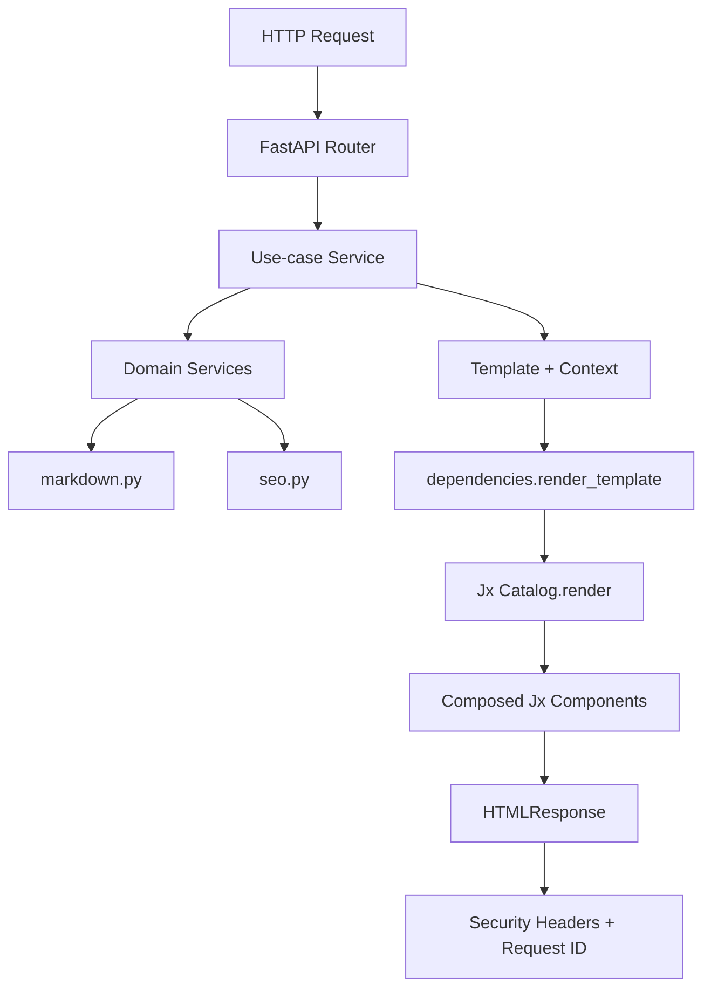
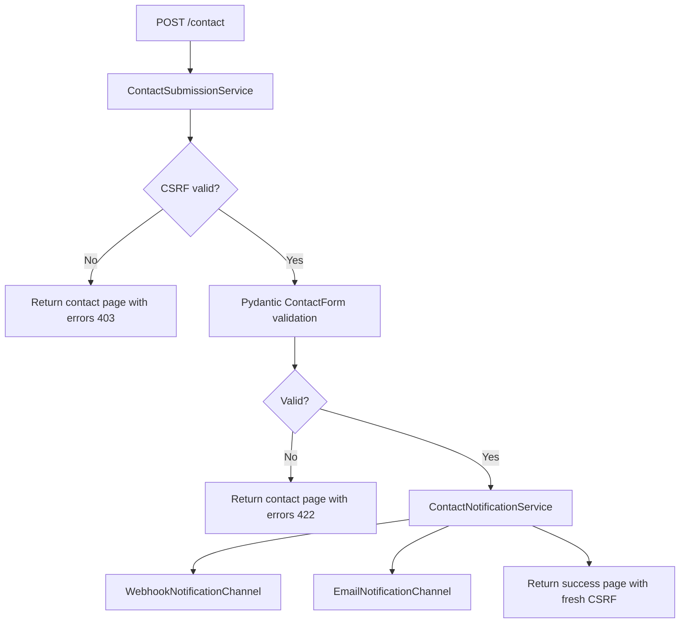

# Portfolio (FastAPI + Jx)

Server-side portfolio built with FastAPI, Jx components, markdown content,
and a service-driven backend architecture.

## Highlights

- FastAPI app factory with dependency injection and thin routers.
- Jx component catalog (`Catalog.render`) for SSR HTML pages.
- Content-driven profile and pages from markdown + YAML frontmatter.
- Contact flow with CSRF protection, strict validation, rate limiting,
  and decoupled notifications.
- Structured request tracing logs with request and trace correlation.
- OpenTelemetry instrumentation (FastAPI + HTTPX) with analytics ingestion API.
- Reusable UI component layer (buttons, icons, breadcrumb, cards, tags,
  inputs, alerts).

## Tech Stack

### Backend

| Technology              | Purpose                                     |
| ----------------------- | ------------------------------------------- |
| FastAPI                 | Routing, DI, middleware, exception handling |
| Uvicorn                 | ASGI runtime                                |
| Pydantic v2             | Schema validation for forms and SEO         |
| pydantic-settings       | Environment-driven settings                 |
| SlowAPI                 | Per-IP rate limiting (`POST /contact`)      |
| httpx                   | Async webhook notifications                 |
| smtplib + email.message | SMTP notifications                          |
| markdown + pygments     | Markdown rendering + syntax highlight       |
| PyYAML                  | YAML frontmatter parsing                    |
| bleach                  | HTML sanitization for markdown output       |
| OpenTelemetry           | Tracing, metrics, log correlation           |

### Frontend / Rendering

| Technology                             | Purpose                                |
| -------------------------------------- | -------------------------------------- |
| Jx                                     | Component abstraction on top of Jinja2 |
| Jinja2                                 | Template runtime used by Jx            |
| Tailwind (runtime config) + custom CSS | UI styling + responsive behavior       |
| Vanilla JS                             | Menu, snap navigation, UX scripts      |

### Quality

| Tool  | Purpose              |
| ----- | -------------------- |
| Ruff  | Linting              |
| ty    | Static type checks   |
| rumdl | Markdown lint/format |

## Architecture

### High-level flow



### Contact submission flow



## Current Project Structure

```text
app/
  __init__.py
  main.py
  api/
    __init__.py
    router.py
    analytics.py
    about.py
    contact.py
    home.py
    projects.py
  core/
    __init__.py
    config.py
    dependencies.py
    logger.py
    security.py
  domain/
    __init__.py
    models.py
    schemas.py
  services/
    __init__.py
    about.py
    contact.py
    home.py
    profile.py
    projects.py
    seo.py
    types.py
  infrastructure/
    __init__.py
    markdown.py
    notifications/
      __init__.py
      email.py
  observability/
    __init__.py
    analytics.py
    events.py
    metrics.py
    telemetry.py
  rendering/
    __init__.py
    catalog.py
    engine.py

content/
  about.md
  projects/
    api-observability-hub.md
    distributed-task-orchestrator.md
    markdown-knowledge-base.md
    secure-contact-pipeline.md

components/
  layouts/
    base.jinja
    home.jinja
    public.jinja
  pages/
    about.jinja
    contact.jinja
    home.jinja
    maintenance.jinja
    not-found.jinja
    project-detail.jinja
    projects.jinja
  ui/
    alert.jinja
    breadcrumb.jinja
    button.jinja
    card.jinja
    footer.jinja
    header.jinja
    icon.jinja
    input.jinja
    navbar.jinja
    prose.jinja
    section-link.jinja
    seo-head.jinja
    social-links.jinja
    tag.jinja
  features/
    contact/
      contact-form.jinja
    home/
      contact-preview.jinja
      profile-summary.jinja
      projects-preview.jinja
    projects/
      project-card.jinja
    resume/
      about-section.jinja
      certificates-section.jinja
      education-section.jinja
      experience-section.jinja
      profile-header.jinja
      skills-section.jinja

static/
  css/
    tailwind.css
    tailwind.input.css
    motion.css
    style.css
    tokens.css
  js/
    analytics.js
    main.js
  images/
    og-default.png
    projects/*.svg

infra/
  alerts/
    portfolio-alert-rules.yaml
  grafana/
    portfolio-overview-dashboard.json
```

## Backend Design

### App lifecycle (`app/main.py`)

- Configures structured logging.
- Creates FastAPI instance with docs enabled only in debug mode.
- Mounts `/static` if directory exists.
- Registers middleware:
  - `RequestTracingMiddleware`
  - `SecurityHeadersMiddleware`
- Configures OpenTelemetry instrumentation.
- Wires SlowAPI rate limit exception handler.
- Registers routers (`home`, `about`, `projects`, `contact`, `analytics`).
- Handles 404 with rendered `pages/not-found.jinja`.

### Dependency graph (`app/core/dependencies.py`)

- `get_catalog()` builds a singleton Jx catalog.
- Catalog folders are namespaced with prefixes:
  - `components/ui/` as `@ui/...`
  - `components/layouts/` as `@layouts/...`
  - `components/features/` as `@features/...`
  - `components/pages/` as `@pages/...`
- Prefix setup pattern:

```python
catalog.add_folder("components/ui", prefix="ui")
catalog.add_folder("components/layouts", prefix="layouts")
catalog.add_folder("components/features", prefix="features")
catalog.add_folder("components/pages", prefix="pages")
```

- Prefixed import pattern:

```jinja
{#import "@layouts/public.jinja" as PublicLayout #}
{#import "@ui/button.jinja" as Button #}
{#import "@features/projects/project-card.jinja" as ProjectCard #}
```

- Profile globals are loaded from `content/about.md` and injected globally:
  - `site_name`
  - `profile_name`
  - `profile_role`
  - `profile_location`
  - `profile_summary` (from `description`)
  - `social_links`
- `render_template()` is strict and does not silently fall back.
- Services are provided as singleton dependencies:
  - page use-cases
  - contact submission service
  - notification service with channels
  - analytics service

### Use-cases (`app/services/`)

- `HomePageService`: builds featured project context and CSRF token.
- `AboutPageService`: loads markdown profile content and metadata.
- `ProjectsPageService`: list and detail page composition.
- `ContactPageService`: page context with CSRF, form state, and messages.
- `ContactSubmissionService`: normalization, CSRF validation, and Pydantic validation.

## Routing Matrix

| Method | Path                      | Router            | Template                     | Notes                                       |
| ------ | ------------------------- | ----------------- | ---------------------------- | ------------------------------------------- |
| GET    | `/`                       | `home.py`         | `pages/home.jinja`           | Featured projects + profile hero            |
| GET    | `/about`                  | `about.py`        | `pages/about.jinja`          | Resume-style sections from frontmatter      |
| GET    | `/projects`               | `projects.py`     | `pages/projects.jinja`       | Project cards list                          |
| GET    | `/projects/{slug}`        | `projects.py`     | `pages/project-detail.jinja` | Detail page + action buttons                |
| GET    | `/contact`                | `contact.py`      | `pages/contact.jinja`        | Contact form + CSRF                         |
| POST   | `/contact`                | `contact.py`      | `pages/contact.jinja`        | CSRF, validation, notifications, rate limit |
| POST   | `/api/v1/analytics/track` | `analytics.py`    | JSON                         | Client telemetry ingestion                  |
| GET    | `*`                       | exception handler | `pages/not-found.jinja`      | Rendered 404 page                           |

## Frontend / Jx Layer

### Layouts

- `layouts/base.jinja`: HTML shell, SEO component, CSS/JS includes.
- `layouts/public.jinja`: navbar + content container + footer.
- `layouts/home.jinja`: full-viewport scroll-snap homepage shell.

### Reusable UI components

- `ui/breadcrumb.jinja`: reusable breadcrumb with dynamic items.
- `ui/button.jinja`: variants/sizes for links and buttons.
- `ui/icon.jinja`: glyph-only icon component.
- `ui/social-links.jinja`: social links layout variants.
- `ui/card.jinja`, `ui/tag.jinja`, `ui/input.jinja`, `ui/alert.jinja`,
  `ui/section-link.jinja`, `ui/header.jinja`, `ui/navbar.jinja`,
  `ui/footer.jinja`, `ui/seo-head.jinja`, `ui/prose.jinja`.
- Prefixed first-party components are used across the app, example:
  - `{#import "@layouts/public.jinja" as PublicLayout #}`
  - `{#import "@ui/social-links.jinja" as SocialLinks #}`
  - `{#import "@features/projects/project-card.jinja" as ProjectCard #}`

### Page composition

- Home: profile hero, projects section, contact section.
- About: profile header + work, education, certificates, skills.
- Projects: list page and detail page with tech chips and CTA buttons.
- Contact: social links + form.

## Content Model

### `content/about.md` frontmatter

Key fields used by the app:

- `name`
- `role`
- `location`
- `description` (short profile summary; used on Home)
- `full_description` (long profile text; used as About body)
- `social_links` (`github`, `linkedin`, `x`, optional `email`)
- `work_experience[]`
- `education[]`
- `certificates[]`
- `skills[]`

`load_about()` prioritizes `full_description` as rendered markdown body.

### `content/projects/*.md` frontmatter

Supported fields:

- `title`, `slug`, `description`, `thumbnail`
- `tags`, `tech_stack`
- `github_url`, `live_url`
- `date`, `featured`

## Security and Reliability

- CSRF token generation + validation with HMAC-SHA256 + expiry.
- CSRF token bound to user-agent hash.
- Strict Pydantic form validation (`extra="forbid"`).
- Strict form content-type validation on submission.
- IP-based rate limit on contact submissions.
- Sanitized markdown HTML rendering.
- Security headers middleware:
  - `X-Content-Type-Options`
  - `X-Frame-Options`
  - `Referrer-Policy`
  - `Permissions-Policy`
  - `HSTS` + `CSP` in non-debug mode
- Request tracing middleware with request ID header propagation.
- OpenTelemetry traces and metrics for HTTP and analytics events.

## Logging and Tracing

`app/core/logger.py` configures structured logs with request context fields:

- `req_id`
- `method`
- `path`
- `ip`
- `trace_id`
- `span_id`

Example format:

```text
2026-02-26 01:00:00 | INFO | app.api.home |
req_id=... method=GET path=/ ip=... | Home page rendered.
```

## Configuration

Settings are defined in `app/core/config.py` and loaded from `.env`.

### Required

| Variable     | Description              |
| ------------ | ------------------------ |
| `SECRET_KEY` | Used to sign CSRF tokens |

### Common optional

| Variable                           | Description                                                  |
| ---------------------------------- | ------------------------------------------------------------ |
| `DEBUG`                            | Enables docs/openapi and dev behavior                        |
| `APP_NAME`                         | FastAPI title                                                |
| `APP_DESCRIPTION`                  | FastAPI description                                          |
| `SITE_NAME`                        | Fallback site/profile name                                   |
| `BASE_URL`                         | Canonical URL base                                           |
| `RATE_LIMIT`                       | SlowAPI format (example `10/minute`)                         |
| `CONTACT_WEBHOOK_URL`              | Webhook endpoint for contact notifications                   |
| `CONTACT_EMAIL_TO`                 | Target email for SMTP notifications                          |
| `SMTP_*`                           | SMTP transport settings                                      |
| `TELEMETRY_ENABLED`                | Enables OpenTelemetry pipeline                               |
| `TELEMETRY_EXPORTER_OTLP_ENDPOINT` | OTLP gRPC endpoint (SigNoz default: `http://localhost:4317`) |
| `TELEMETRY_EXPORTER_OTLP_INSECURE` | Uses insecure OTLP transport for local setups                |
| `TELEMETRY_LOGS_ENABLED`           | Enables OpenTelemetry log export                             |
| `TELEMETRY_EXPORTER_OTLP_HEADERS`  | Optional OTLP headers (`key=value`) for SigNoz Cloud         |

### Example `.env`

```env
SECRET_KEY=replace-with-a-strong-random-secret
DEBUG=true
SITE_NAME=Fabio Souza
BASE_URL=http://localhost:8000
CONTACT_WEBHOOK_URL=
CONTACT_EMAIL_TO=
TELEMETRY_ENABLED=true
TELEMETRY_EXPORTER_OTLP_ENDPOINT=http://localhost:4317
TELEMETRY_EXPORTER_OTLP_INSECURE=true
TELEMETRY_LOGS_ENABLED=true
# TELEMETRY_EXPORTER_OTLP_HEADERS=signoz-ingestion-key=<your-key>
```

## SigNoz integration

With the telemetry settings above, the backend exports traces, metrics, and logs
to SigNoz over OTLP. The emitted service identity is:

- `service.name=portfolio-backend`
- `service.namespace=portfolio`

Detailed runbook and validation checklist: `docs/observability.md`.

## Development

### Install dependencies

```bash
uv sync
```

### Run app

```bash
uv run uvicorn app.main:app --reload --host 0.0.0.0 --port 8000
```

### Quality checks

```bash
uv run ruff check app
uv run ty check app
uv run pytest -q
DEBUG=true PYTHONPATH=. uv run jx check app/rendering/catalog.py:catalog
uv run rumdl check .
```

### Optional markdown formatting

```bash
uv run rumdl fmt README.md
```

### Optional pre-commit hooks

```bash
uvx pre-commit install
uvx pre-commit run --all-files
```

### Optional rebuild of Tailwind CSS

```bash
npx tailwindcss@3.4.17 -c tailwind.config.cjs \
  -i static/css/tailwind.input.css \
  -o static/css/tailwind.css --minify
```

## Notes

- This project intentionally uses SSR with Jx and does not depend on a SPA framework.
- Profile identity and social links are content-driven from `content/about.md`.
- Tailwind classes are served from local compiled `static/css/tailwind.css`
  (no CDN runtime dependency).
- Observability starter assets live in `infra/` and
  `docs/observability.md`.
