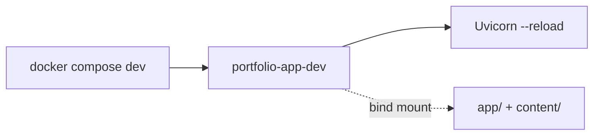
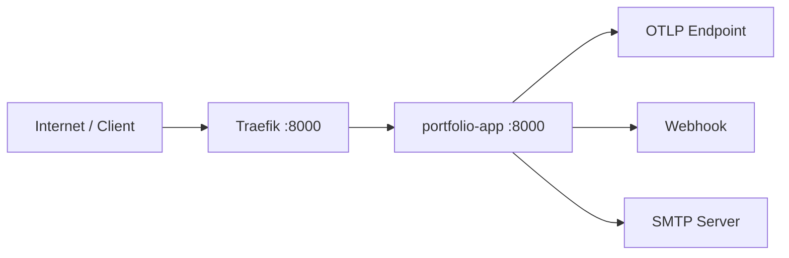

# Infrastructure

## Runtime Environments

The project ships with two Docker environments.

| Environment | Compose File                     | Goal                                      |
| ----------- | -------------------------------- | ----------------------------------------- |
| Development | `docker/docker-compose.yml`      | Fast feedback with reload and bind mounts |
| Production  | `docker/docker-compose.prod.yml` | Reverse proxy + hardened runtime          |

## Dockerfiles

| Dockerfile               | Use                                     |
| ------------------------ | --------------------------------------- |
| `docker/Dockerfile.dev`  | Installs all groups, enables reload     |
| `docker/Dockerfile.prod` | Installs runtime deps only (`--no-dev`) |

## Development Topology

## Production Topology

## Traefik Configuration (File-Based)

Static config:

- `docker/traefik/traefik.yml`
- File provider watching `/etc/traefik/dynamic`

Dynamic config:

- `docker/traefik/dynamic/routing.yml`
- Defines routers, middlewares, and backend service

Configured routers:

- `portfolio-web` for public website traffic
- `portfolio-contact` for `POST /contact`
- `portfolio-analytics` for `POST /api/v1/analytics/track`

Configured edge controls:

- Global and route-specific rate limiting
- In-flight request cap
- Body size limits per route profile
- IP allowlist for analytics endpoint
- Compression middleware

## Application Runtime Hardening (Prod)

From `docker/docker-compose.prod.yml`:

- `read_only: true`
- `tmpfs: /tmp`
- `security_opt: no-new-privileges:true`
- Internal Docker network (`portfolio-edge`) with explicit subnet `172.28.0.0/16`
- `--forwarded-allow-ips` restricted to the Docker subnet CIDR (prevents header spoofing)
- App is private behind Traefik
- Health check via `GET /health` endpoint

## Observability Assets

- `infra/grafana/portfolio-overview-dashboard.json`
- `infra/alerts/portfolio-alert-rules.yaml`
- Runbook: `infra/README.md` (includes SigNoz setup)

## CI/Quality Automation

`.github/workflows/ci.yml` runs:

- `ruff format` + `rumdl fmt` + diff verification
- `ruff check`, `ty check`
- pytest suite
- API route coverage gate (`--cov-fail-under=100` for `app/api`)
- markdown checks (`rumdl check`)
- Jx catalog check

Task automation is available via Taskipy in `pyproject.toml`.
