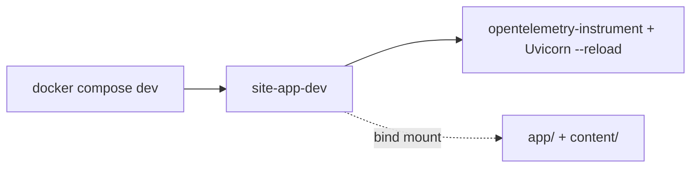

# Infrastructure

## Runtime Environments

The project ships with two Docker environments.

| Environment | Compose File                     | Goal                                      |
| ----------- | -------------------------------- | ----------------------------------------- |
| Development | `docker/docker-compose.yml`      | Fast feedback with reload and bind mounts |
| Production  | `docker/docker-compose.prod.yml` | Reverse proxy + hardened runtime          |

## Dockerfiles

| Dockerfile               | Use                                     |
| ------------------------ | --------------------------------------- |
| `docker/Dockerfile.dev`  | Installs all groups, enables reload     |
| `docker/Dockerfile.prod` | Installs runtime deps only (`--no-dev`) |

## Development Topology

```mermaid
flowchart LR
    C[docker compose dev] --> A[site-app-dev]
    A --> U[opentelemetry-instrument + Uvicorn --reload]
    A -. bind mount .-> Src[app/ + content/]
```

## Production Topology

```mermaid
flowchart LR
    I[Internet / Client] --> T[Traefik :${PROD_PUBLIC_HTTP_PORT:-80}]
    T --> A[site-app :8000]
    A --> O[OTLP Endpoint]
    A --> W[Webhook]
    A --> S[SMTP Server]
```

## Traefik Configuration (File-Based)

Static config:

- `docker/traefik/traefik.yml`
- File provider watching `/etc/traefik/dynamic`

Dynamic config:

- `docker/traefik/dynamic/routing.yml`
- Defines routers, middlewares, and backend service

Configured routers:

- `site-web` for public website traffic
- `site-contact` for `POST /contact`
- Browser traces use same-origin `POST /otel/v1/traces` served by the app,
  which forwards to the OTLP HTTP collector

Configured edge controls:

- Global rate limiting
- In-flight request cap
- Body size limits per route profile
- Compression middleware

## Application Runtime Hardening (Prod)

From `docker/docker-compose.prod.yml`:

- `read_only: true`
- `tmpfs: /tmp`
- `security_opt: no-new-privileges:true`
- Internal Docker network (`site-edge`) with explicit subnet `172.28.0.0/16`
- `--forwarded-allow-ips` restricted to the Docker subnet CIDR
  (prevents header spoofing)
- App is private behind Traefik
- Production compose maps `PROD_*` env vars to app-layer checks:
  `PROD_TRUSTED_HOSTS` -> `TRUSTED_HOSTS`
  `PROD_CORS_ALLOW_ORIGINS` -> `CORS_ALLOW_ORIGINS`
  `PROD_FRONTEND_TELEMETRY_ENABLED` -> `FRONTEND_TELEMETRY_ENABLED`
  `PROD_FRONTEND_TELEMETRY_OTLP_ENDPOINT` -> `FRONTEND_TELEMETRY_OTLP_ENDPOINT`
- Production compose maps `PROD_OTEL_*` env vars directly to the
  `opentelemetry-instrument` process
- Health check via `GET /health` endpoint

## Observability Assets

- `infra/signoz/dashboards/site-unified-operations.json`
- `infra/signoz/dashboards/site-backend-overview.json`
- `infra/signoz/dashboards/site-frontend-telemetry.json`
- `infra/signoz/alerts/*.json`
- The unified dashboard is the main day-to-day operations view across backend,
  frontend, contact flow, and OTLP proxy health
- The backend dashboard covers traffic, latency, status breakdowns, top paths,
  contact outcomes, notification latency, and OTLP proxy health
- The frontend dashboard covers lifecycle spans, user interaction events,
  contact form client flow, top operations, and OTLP proxy health
- Alert manifests cover backend 5xx ratio, backend p95 latency, notification
  latency, contact delivery degradation, frontend error rate, frontend
  document-load latency, and OTLP proxy failures
- Runbooks: `infra/README.md` and `infra/signoz/README.md`
- `uv run task run`, `uv run task run_prod`, and `uv run task run_otel` all
  execute `opentelemetry-instrument uvicorn ...`
- Local task commands load `.env` into the CLI process with
  `uv run --env-file .env ...`
- `OTEL_*` variables configure the backend SDK directly; the app no longer
  bootstraps providers in-process
- Browser tracing is configured with `FRONTEND_TELEMETRY_*` settings and uses
  the same-origin OTLP proxy route `/otel/v1/traces`
- Grafana and Prometheus rule assets are no longer maintained in this repo;
  SigNoz is the supported observability target

## CI/Quality Automation

`.github/workflows/ci.yml` runs:

- `ruff format` + `rumdl fmt` + diff verification
- `ruff check`, `ty check`
- pytest suite
- API route coverage gate (`--cov-fail-under=100` for `app/api`)
- markdown checks (`rumdl check`)
- Jx catalog check

.github/workflows/docker-publish.yml runs:

- Docker Buildx setup
- GHCR login with `GITHUB_TOKEN`
- OCI metadata/label generation
- production image build from `docker/Dockerfile.prod`
- push to `ghcr.io/<owner>/<repo>` on `master`, `v*` tags, and manual dispatch

Task automation is available via Taskipy in `pyproject.toml`.
